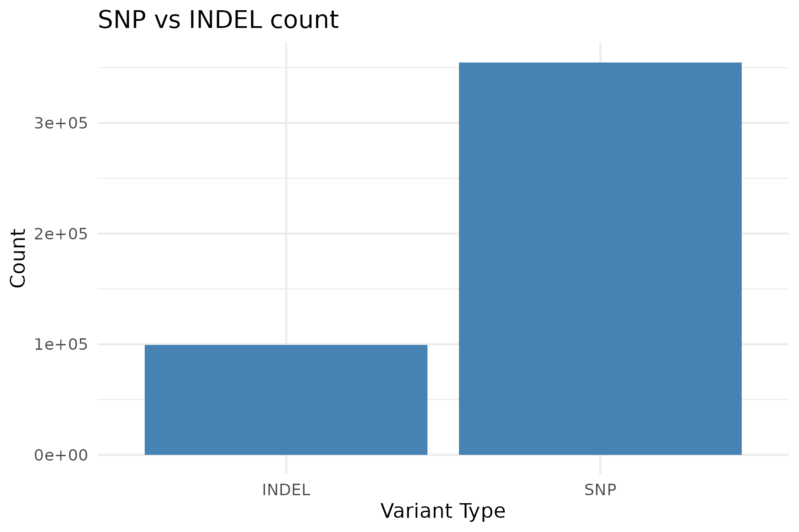
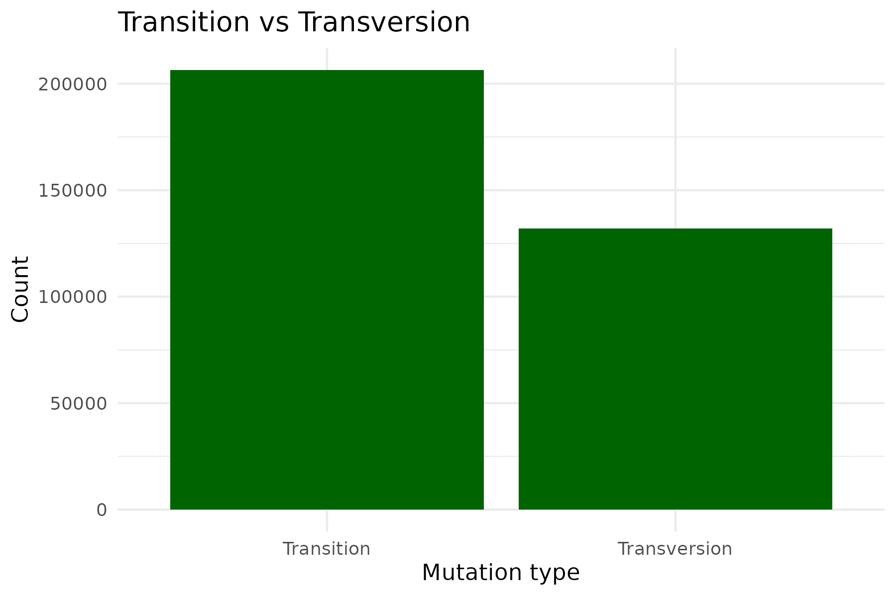
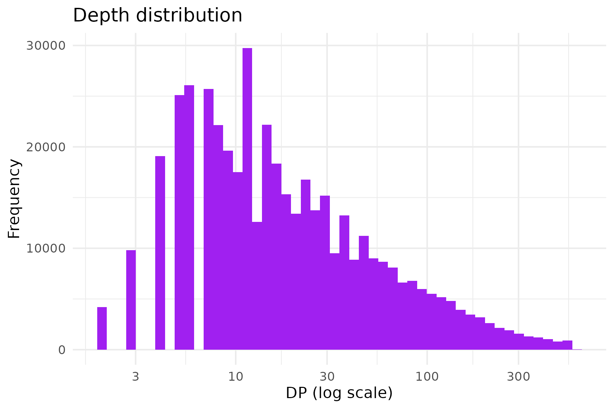
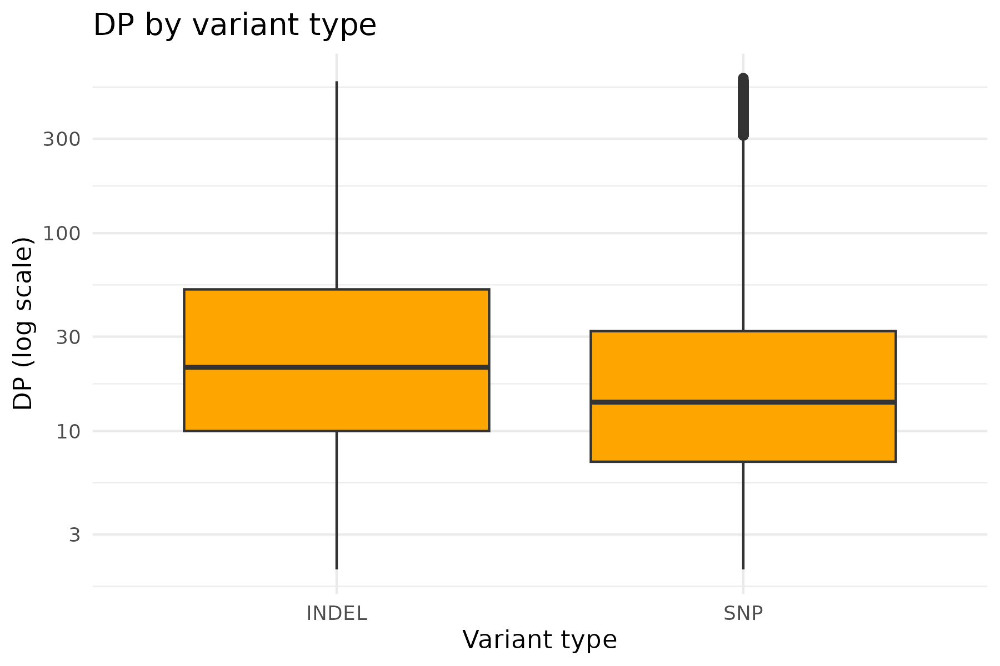
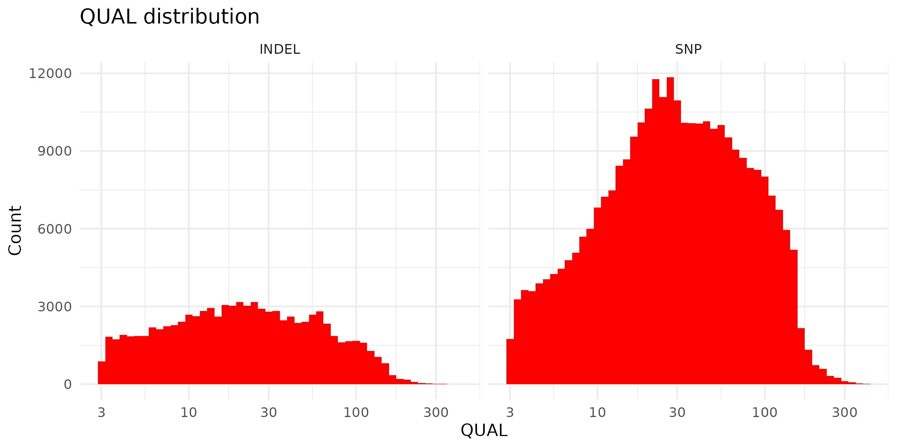
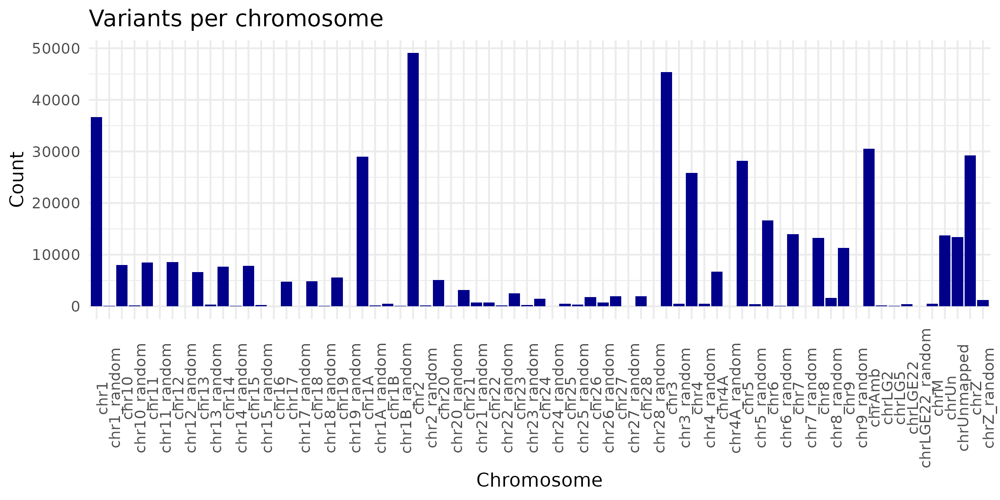

[](https://classroom.github.com/a/SzF8zjrH)
# Unix Course Final Assignment
This is a template repository for the Unix course final assignment. You should use this template to submit your solution to the final assignment.

Put your shell code in `workflow.sh` and the R code to visualise results in `data-analysis.R`.

Here, please, describe the individual steps in your pipeline and the actual results...


# Unix Course Final Assignment

This repository contains the final assignment for the Unix course. It includes a shell script (`workflow.sh`) to process VCF files and an R script (`data-analysis.R`) to visualize the results.  

All plots are saved in the `results/` directory.

---

##  Workflow

### Shell script: `workflow.sh`

The shell script performs the following steps:

1. Extracts VCF records without headers.
2. Selects the first 6 columns.
3. Extracts DP (read depth) values, replacing missing values with `NA`.
4. Classifies variants as SNP or INDEL.
5. Classifies mutations as Transition or Transversion (single nucleotide variants only).
6. Combines all columns into a single TSV file with proper headers.

```bash
# Extract VCF records without headers
zcat /data-shared/vcf_examples/luscinia_vars.vcf.gz | grep -v '^##' > no-headers.vcf

# Extract first 6 columns
IN=no-headers.vcf
<$IN cut -f1-6 > cols1-6.tsv

# Extract DP (read depth), with NA for missing
<$IN awk '{
    if(match($0,/DP=([0-9]+)/))
        print substr($0,RSTART+3,RLENGTH-3)
    else
        print "NA"
}' > dp.tsv

# Classify SNP vs INDEL
<$IN awk '{if($0 ~ /INDEL/) print "INDEL"; else print "SNP"}' > col-type.tsv

# Classify mutations: Transition vs Transversion
<$IN awk -F'\t' '{
    if(length($4)==1 && length($5)==1){
        pair=$4$5
        if(pair=="AG" || pair=="GA" || pair=="CT" || pair=="TC")
            print "Transition"
        else
            print "Transversion"
    } else print "NA"
}' > col-transition.tsv

# Combine all columns and add header
paste cols1-6.tsv dp.tsv col-type.tsv col-transition.tsv > cols-all.tsv
sed -i '1s/.*/#CHROM\tPOS\tID\tREF\tALT\tQUAL\tDP\tSNP.INDEL\tMutation_type/' cols-all.tsv


# Using data-analysis.R, there will be 6 plots saved in results directory




```bash
p1 <- d %>%
  ggplot(aes(x = SNP.INDEL)) +
  geom_bar(fill = "steelblue") +
  theme_minimal() +
  labs(title = "SNP vs INDEL count",
       x = "Variant Type",
       y = "Count")
ggsave("results/SNP_vs_INDEL.png", p1, width = 6, height = 4)
```


```bash
p2 <- d %>%
  filter(Mutation_type != "NA") %>%
  ggplot(aes(x = Mutation_type)) +
  geom_bar(fill = "darkgreen") +
  theme_minimal() +
  labs(title = "Transition vs Transversion",
       x = "Mutation type",
       y = "Count")
ggsave("results/Transition_vs_Transversion.png", p2, width = 6, height = 4)
```


```bash
p3 <- d %>%
  ggplot(aes(x = DP)) +
  geom_histogram(bins = 50, fill = "purple") +
  scale_x_log10() +
  theme_minimal() +
  labs(title = "Depth distribution",
       x = "DP (log scale)",
       y = "Frequency")
ggsave("results/DP_distribution.png", p3, width = 6, height = 4)
```


```bash
p4 <- d %>%
  ggplot(aes(x = SNP.INDEL, y = DP)) +
  geom_boxplot(fill = "orange") +
  scale_y_log10() +
  theme_minimal() +
  labs(title = "DP by variant type",
       x = "Variant type",
       y = "DP (log scale)")
ggsave("results/DP_by_variant_type.png", p4, width = 6, height = 4)
```


```bash
p5 <- d %>%
  filter(QUAL < 900) %>%
  ggplot(aes(x = QUAL)) +
  geom_histogram(bins = 50, fill = "red") +
  scale_x_log10() +
  facet_wrap(~ SNP.INDEL) +
  theme_minimal() +
  labs(title = "QUAL distribution",
       x = "QUAL",
       y = "Count")
ggsave("results/QUAL_distribution.png", p5, width = 8, height = 4)
```


```bash
p6 <- d %>%
  count(`#CHROM`) %>%
  ggplot(aes(x = `#CHROM`, y = n)) +
  geom_bar(stat = "identity", fill = "darkblue") +
  theme_minimal() +
  theme(axis.text.x = element_text(angle = 90)) +
  labs(title = "Variants per chromosome",
       x = "Chromosome",
       y = "Count")
ggsave("results/Variants_per_chromosome.png", p6, width = 8, height = 4)
```

```bash
ti <- d %>% filter(Mutation_type == "Transition") %>% nrow()
tv <- d %>% filter(Mutation_type == "Transversion") %>% nrow()
ti_tv_ratio <- ti / tv

# Save Ti/Tv ratio as a text file
writeLines(paste0("Transition/Transversion ratio: ", round(ti_tv_ratio, 3)),
           "results/Ti_Tv_ratio.txt")

# Print to console
ti_tv_ratio
```

What are the results?

> ti_tv_ratio
[1] 1.564815
